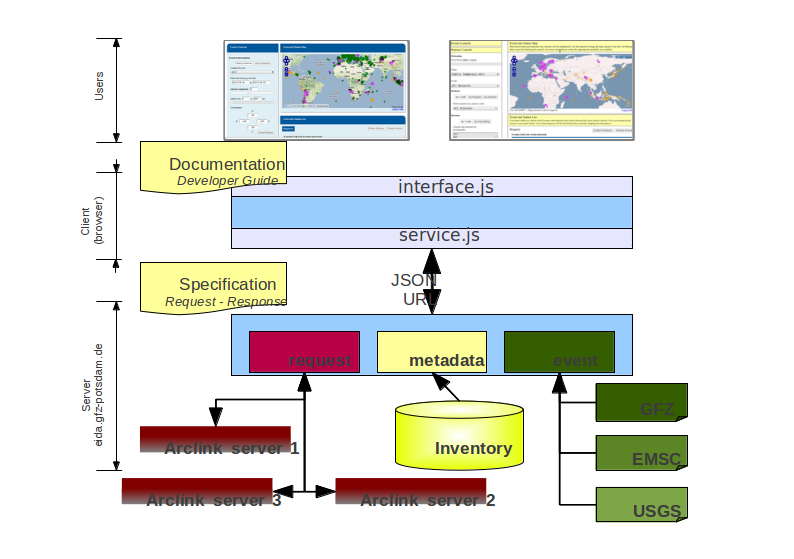

.. _operator-guide:

***********************
Operator Instructions
***********************

WebDC3 web interface generator
==============================

Here we outline what you may need to do to get the web interface up and running
on your site. Things may be different for your site depending on your
operating system, web server, network policies and so on.

The web interface mainly uses JavaScript for presentation,
with Python used to provide underlying services.

.. note ::
   WebDC3 has a modular design.
   Here goes something about the modules:

    * presentation
    * events
    * stations
    * requests
    * maps
    * console

   See the :ref:`developer-guide` for more details about the modules.

Presentation
------------
The design adopted for the implementation uses Ajax queries to load the individual page blocks.
The final page assembles those blocks.
You (a web site operator) have complete freedom to build your own page layout from the basic supplied blocks. The basic blocks are:

 1) Event Search Control block
 2) Station Search Control block
 3) Mapping Control block (plot events and stations)
 4) Request Control block
 5) Submitting block
 6) Status Control block
 7) Status Results block
 8) Console block

Further blocks can be implemented and later integrated into the current architecture design.
Since each block is a self-contained unit we believe they will fit pretty well in any CMS or existing web pages at EIDA nodes, or even the EIDA portal at ODC.

Python and JavaScript (JS)
==========================

The complete interface needs a Python back end running, using the WSGI interface.
In the Apache web server this is implemented in mod_wsgi.
The back end uses the SeisComP seiscomp3 Python libraries for distance and travel time computation, configuration, and logging.
The Python back end is responsible for:

 a) Fetch events information for the presentation layer (JavaScript) from different web services or databases.
 b) Fetch NSLC (network-station-location-channel, i.e. inventory) information to the presentation layer from an Arclink server.
 c) Place requests to one or many Arclink servers.
 d) Send e-mail to the user about her/his requests. **FIXME: Do we still do that? Should we**
 e) Fetch the status information from the Arclink server and send it to the presentation layer.

and a JavaScript set of modules that will contact the back end services and render the page on the user's browser client and control the work flows on the page.

Also built in the back end there is an option to send configuration variables as key-value pairs from the server back end to the client JavaScript layer.
These variables are initially defined in a configuration file on the server.
They are fetched by the JavaScript layer and any module on the client has access to those variables that helps to guide the JavaScript in rendering the page.
One clear example of such variables is the Web Mapping Service (WMS) address (URL) that is used by the Mapping control block.
For the event control the default values for the magnitude filters and depth filters are also obtained from the server through this mechanism.
(See :ref:`configuration-options` for details.)

Basic Page Set
==============

Together with this package we are also supplying a set of static pages (HTML files) that can be used as a reference on how to use the package to build your customized interface.
During the development of the modules we try not to force any possible work flow.
See the content of the `examples` directory.

The basic page set is composed of two pages, one for making requests and one for checking status information. The request page use demonstrate how to use the modules numbered as 1, 2, 3, 4, 5 and 6 (block list above) and the status page uses blocks numbers 6 and 7.

  .. note::
        Make a table. Add screen shots. **TODO**

The customization of the pages should be done completely in HTML, using the 'class' and 'id' attributes of HTML entities. The basic idea is that each block renders itself inside a certain '
' element, identified by a special 'id'. Also some blocks can accept options that are passed through the 'class' attribute on the '
'.
For example, the apparently empty element::

  

would in the end be filled by the StationSearchControl block. And code like this::

  

would load the the StationSearchControl block, but the class ``nosensor`` would inhibit the sensor selection dialog to be present allowing each node to further customize its interface.

  .. note ::
	Adding `class='nosensor'` doesn't work, Aug 31 2013.

Also, since HTML allows multiple classes to the same container options related to formatting and option for the block control would coexist on the same '
'. Furthermore on the customization part of the operator manual [REF] you can find all the special 'id' and class options that are accepted by each control block to be associated to a certain 'id'.

The Loader
==========

To build the interface on your basic static HTML page all you need to do is to load the 'loader.js' script from the server into your page.
When this file is executed in the client, it loads the other required JavaScript modules, guaranteeing the correct load order, as one module can depend on others.

If no '
' with the 'id' of a particular module is not found on the page then that module will be disabled.

Requirements
============

 * SeisComP(reg) 3 provides useful functions for configuration, geometry, travel time computation.

 * Seiscomp Python library (`$SEISCOMP_ROOT/lib/python/seiscomp`), may not be needed now.

 * JavaScript libraries: jquery-base, jquery-ui [https://jquery.org/]

 * OpenLayers. [http://www.openlayers.org/]

 * Python, mod_wsgi (if using Apache). Also Python libraries for libxslt and libxml.

 * Finally, users' web browsers need to run JavaScript.

 * Some testing/setup scripts use `wget`.

.. _download:

Download
========

The code can be downloaded in a tar file from the GEOFON web page at
http://geofon.gfz-potsdam.de/software. Nightly builds can be downloaded from
Github at [https://github.com/EIDA/webdc3].

If you downloaded the compressed file, untar it into a suitable directory
visible to the web server, such as `/var/www/webinterface`::

  cd /var/www/webinterface
  tar xvzf /path/to/tarfile.tgz

This location will depend on the location of the root (in the file system)
 for your web server.

If you want to clone it from Github, do it in a suitable directory as explained
in the previous point.::

  cd /var/www
  git clone https://github.com/EIDA/webdc3 webinterface

.. _oper_installation-on-apache:

Installation on Apache
======================

To deploy the WebDC3 web interface on an Apache2 web server using `mod_wsgi`:

 0. Unpack the files into the chosen directory.
    (See Download_ above.)
    In these instructions we assume this directory is `/var/www/webinterface`.

 #. Enable `mod_wsgi`. For openSUSE, add 'wsgi' to the list of modules in the APACHE_MODULES variable in `/etc/sysconfig/apache2`::

       APACHE_MODULES+=" python wsgi"

    and restart Apache. You should now see the following line in your
    configuration (in `/etc/apache2/sysconfig.d/loadmodule.conf` for **openSUSE**)::

        LoadModule wsgi_module   /usr/lib64/apache2/mod_wsgi.so

    You can also look at the output from ``a2enmod -l`` - you should see wsgi listed.

    For **Ubuntu/Mint**, you can enable the module with the command::

        sudo a2enmod wsgi

    and you can restart apache with::

        sudo service apache2 stop
        sudo service apache2 start

    If the module was added succesfully you should see the following two links in
    ``/etc/apache2/mods-enabled``::

        wsgi.conf -> ../mods-available/wsgi.conf
        wsgi.load -> ../mods-available/wsgi.load

    For any distribution there may be a message like this in Apache's `error_log` file, showing
    that `mod_wsgi` was loaded::

        [Tue Jul 16 14:24:32 2013] [notice] Apache/2.2.17 (Linux/SUSE)
	PHP/5.3.5 mod_python/3.3.1 Python/2.7 mod_wsgi/3.3 configured
	 -- resuming normal operations

 #. Add the following lines to a new file, `conf.d/webinterface.conf`, or in
    `default-server.conf`, or in the configuration for your virtual host::

     WSGIScriptAlias /webinterface/wsgi /var/www/webinterface/wsgi/webdc3.wsgi
        <Directory /var/www/webinterface/wsgi/>
            Order allow,deny
            Allow from all
        </Directory>

    You may be able to use the provided file `webdc3.conf.sample`: copy it to
    `/etc/apache2/conf-available` and symlink from `/etc/apache2/conf-enabled`.

    Change `/var/www/webinterface` to suit your own web server's needs.
    You may also need to add a section like::

        <Directory /var/www/webinterface/>
            Order allow,deny
            Allow from all
        </Directory>

 #. Set environment for Apache: Apache needs the "SeisComP" environment
    variables set when it starts. The seiscomp3 `bin` and `man`
    directories aren't needed. For **OpenSUSE**, add the following lines, which
    are provided by `seiscomp print env`, to `/etc/sysconfig/apache2`::

        SEISCOMP_ROOT=/home/sysop/seiscomp3
        LD_LIBRARY_PATH=/home/sysop/seiscomp3/lib
        PYTHONPATH=/home/sysop/seiscomp3/lib/python

    (Omit "export" and variable references, those will not work.)

    For **Debian** and **Ubuntu/Mint** add the following lines to the `/etc/apache2/envvars` file::

      # Make SeisComP3 available for webinterface:
      export SEISCOMP_ROOT=/home/sysop/seiscomp3/
      export LD_LIBRARY_PATH=/home/sysop/seiscomp3/lib:$LD_LIBRARY_PATH
      export PYTHONPATH=/home/sysop/seiscomp3/lib/python:$PYTHONPATH

 #. Change to the installation directory and fix the path which is added in `wsgi/webdc3.wsgi`::

      sys.path.insert(0, '/var/www/webinterface/wsgi/')

 #. Copy `webinterface.cfg.sample` to e.g. `$SEISCOMP_ROOT/etc/webinterface.cfg`,
    or make a symbolic link from there to the webinterface directory::

      cp wsgi/webinterface.cfg.sample wsgi/webinterface.cfg
      cd $SEISCOMP_ROOT/etc
      ln -s /var/www/webinterface/wsgi/webinterface.cfg webinterface.cfg

 #. Edit `webinterface.cfg` and be sure to configure correctly the ``SERVER_FOLDER`` and ``arclink.address`` variables. This is discussed under "`Configuration Options`_" below.

 #. Copy one of the top-level example pages to index.html and customise
    the site as you wish.::

      cd {top directory}
      cp examples/generic/*.html .

    Or::

      cp examples/basic/index.html index.html

    Or::

      cp examples/webdc2012/webdc.html index.html

    Or even (but *don't adopt GFZ's corporate design* [#fcorpdesign]_ , unless you're at GFZ)::

      cp examples/webdc3/*.html .

    .. [#fcorpdesign] For more guidance:
        (1) You may not use GFZ logos.
        (2) Please do
        not change the footer text "WebDC3 Interface &copy (2013--)
        Helmholtz-Zentrum Potsdam - Deutsches GeoForschungsZentrum GFZ" and
        the DOI or similar which appears in the `index.html` pages in the
        `examples` directory.
        (3) We would appreciate citation of WebDC3 by its
        doi:10.5880/GFZ.2.4/2016.001 when this is appropriate. Beyond that,
        you have great freedom. You may find the examples under "WebDC3
        users" on the GEOFON software page,
        http://geofon.gfz-potsdam.de/software/webdc3/ helpful.

 #. Start/restart the web server e.g. as root. In **OpenSUSE**::

      # /etc/init.d/apache2 configtest
      # /etc/init.d/apache2 restart

    or in **Ubuntu/Mint** ::

      # sudo service apache2 reload
      # sudo service apache2 stop
      # sudo service apache2 start

 #. Check that the value of ``arclink.address`` is properly set in
    `webinterface.cfg`. For instance::

      arclink.address=eida.gfz-potsdam.de:18002

    Then, get initial metadata in the `data` directory by running the ``update-metadata.py`` script in that directory.
    The meaning and use of the general parameters are the following: ::

      $ cd /var/www/webinterface/data
      $ ./update-metadata.py -h
      usage: update-metadata.py [-h] [-a ADDRESS] [-p PORT] [-o OUTPUT] [-v]
                                {eida,singlenode} ...

      Script to update the metadata for the usage of WebDC3

      positional arguments:
        {eida,singlenode}
          eida                Get master table from EIDA
          singlenode          Create master table based on local inventory. Type
                              "update-metadata.py singlenode -h" to get detailed
                              help.

      optional arguments:
        -h, --help            show this help message and exit
        -a ADDRESS, --address ADDRESS
                              Address of the Arclink Server.
        -p PORT, --port PORT  Port of the Arclink Server.
        -o OUTPUT, --output OUTPUT
                              Filename where inventory should be saved.
        -v, --verbosity       Increase the verbosity level

    In case that WebDC3 must be deployed at an EIDA node, there are not many other parameters. ::

      $ ./update-metadata.py eida -h
      usage: update-metadata.py eida [-h]

      optional arguments:
        -h, --help  show this help message and exit

    And the case of a deployment at a single datacentre not participating in any federation
    of datacentres like EIDA requires more information. Namely, the details about the
    data centre, a contact person, etc. ::

      $ ./update-metadata.py singlenode -h
      usage: update-metadata.py singlenode [-h] [-c CONTACT] [-e EMAIL] [-n NAME]
                                           dcid

      positional arguments:
        dcid                  Short ID of your data centre. Up to 5 letters, no
                              spaces.

      optional arguments:
        -h, --help            show this help message and exit
        -c CONTACT, --contact CONTACT
                              Name of the responsible of WebDC3.
        -e EMAIL, --email EMAIL
                              Email address of the responsible of WebDC3.
        -n NAME, --name NAME  Official name of Datacentre.

    At this stage you should have an XML file, typically called `eida.xml`
    in your `data` directory. Once WebDC3 has run, you will also have the
    cache file `webinterface-cache.bin` there.

 #. It is important to check the permissions of the `data` directory
    and the files in it, as webinterface caches metadata there.
    For instance, in some distributions Apache is run
    by the ``www-data`` user, which belongs to a group with the same name
    (``www-data``).
    The `data` directory should have read-write permission
    for the user running Apache **and** the user who will do the regular metadata updates
    (see crontab configuration in the last point of this instruction list).
    The system will also try to create and
    write temporary information in this directory, but it will still work even
    if this cannot be done.

    .. warning :: Wrong configuration in the permissions of the `data` directory could diminish the performance of the system.

    One possible configuration would be to install the system as a user (for
    instance, `sysop`), who will run the crontab update, with the `data` directory writable by the group of
    the user running Apache (`www-data` in **Ubuntu/Mint**).::

    # cd {top directory}
    # sudo chown -R sysop.www-data .
    # sudo chmod -R g+w data

 #. Visit <http://localhost/webinterface>. You should see the front page.

 #. Arrange for regular updates of the metadata in the `data` directory.
    Something like the following lines will be needed in your crontab::

      # Daily metadata update for webinterface:
      52 03 * * * /var/www/webinterface/data/update-metadata.py eida

    or if you run it outside EIDA: ::

      # Daily metadata update for webinterface:
      52 03 * * * /var/www/webinterface/data/update-metadata.py singlenode \
                  -c CONTACT -e contact@mail.org -n "My name" MYDCID

Installation problems
---------------------
If you see the basic web interface page, but none of the controls load, you
may not have the underlying services running correctly.
Look in your web server log files (e.g. for Apache: `access_log` and
`error_log`) for clues.

If you visit http://localhost/webinterface/wsgi/loader (or similar) on your machine
you should see the definitions that the JavaScript needs to get started::

  var eidaJSSource='/webinterface/js';
  var eidaCSSSource='/webinterface/css';
  var eidaServiceRoot='/webinterface/wsgi';
  var eidaDebug=false;
  $(document).ready(function() { $.getScript(eidaJSSource + '/loader.js') });

If these definitions are not found, then you won't have any controls.
If they *do* show up, check that the URL paths look correct.

You should also be able to visit the "web service" URLs
in your browser e.g. going to::

  http://localhost/webinterface/wsgi/event/catalogs

should show you something like this::

  {"geofon": {"description": "GFZ (eqinfo)", "hasDepth": true, "hasDate":
  true, "hasRectangle": true, ...

.. _configuration-options-extra:

Configuration options
---------------------

Configuration follows the SeisComP3 pattern. Configuration is read from files using a 'dotted' notation e.g.::

  js.wms.server = "http://myserver.org/wms/vmap0"

See the SeisComP documentation [http://www.seiscomp.org/] for details.
Configuration variables beginning with "js" are loaded by the JavaScript loader and made available to scripts in the client's web browser. Other variables are only available to the Python-based back end modules.

The following files are sought, and if present, their configuration
information is loaded, in the order shown:

  1. $SC3ROOT/etc/defaults/global.cfg
  #. $SC3ROOT/etc/defaults/webinterface.cfg
  #. $SC3ROOT/etc/global.cfg
  #. $SC3ROOT/etc/webinterface.cfg
  #. $HOME/.seiscomp3/global.cfg
  #. $HOME/.seiscomp3/webinterface.cfg

Remember that $HOME is for the *user running webinterface*, which might be the same user as runs your web server.
It may be helpful to make a symbolic link from one of these locations to a file in the
webinterface directory e.g.::

  cd /var/www/webinterface; ln -s /path/to/webinterface/wsgi/webinterface.cfg .

At a minimum, you will need to

   #. set `arclink.address` to point to your Arclink server,
   #. set `SERVER_FOLDER` to the top directory of your webinterface installation

to something suitable for your site.
Other options should be suitable for getting started.
You may also wish to adjust the selection of event services.
For full details of all configuration options, see `full-config-options`_.

.. _full-config-options:

General options
~~~~~~~~~~~~~~~

* Mail server details.
  WebDC3 sends e-mail to the address given in the Arclink request confirming that the request has been submitted. **FIXME**

* Temporary files.
  WebDC3 creates files in Python's default temporary directory. This is typically /tmp. This location cannot yet be overridden in webinterface, but you may be able to change it by setting TMPDIR in WebDC3's environment.

Metadata options
~~~~~~~~~~~~~~~~

* List of sensor types.
  This list is displayed in the Stations/Streams tool and can be configured by
  modifying the variable ``self.senstypes`` in the file
  `wsgi/inventorycache.py`.
  The values can be also grouped but must be separated with a space.
  For instance, `VBB BB` will select the streams that
  are either `VBB` or `BB`, while `OBS` will select only the ones that match
  this value.

* Arclink server address::

    arclink.address="eida.gfz-potsdam.de:18002"

  The server to connect to, given as hostname:port. Change this to your local
  Arclink server.

* Arclink nodes configuration file::

    arclink.networkXML = "eida.xml"

  This is an XML file [or a URL?].
  This option enables you to give a list of Arclink servers which can be checked for status of requests. Generally this list should be those servers which are included in the routing table provided by your Arclink server. For an EIDA node, this should be the EIDA master table.

Events options
~~~~~~~~~~~~~~

*FIXME: See options configuration section*

* Event Search Control options::

    js.events.magnitudes.minimum = 3.0
    js.events.depth.minimum = 0
    js.events.depth.maximum = 1000
    js.events.coordinates.north = 90
    js.events.coordinates.south = -90
    js.events.coordinates.west = -180
    js.events.coordinates.east = 180

* Event service configuration options::

    event.[list of services]
    event.names.lookupIfEmpty = True
    event.names.lookupIfGiven = False

.. _op-customization:

Customisation
=============

You may safely modify the following to suit your web site needs:

* webinterface.cfg - this was described above. (Location: where SeisComP looks for configuration files.)

* index.html template document.
  The template must do the following:

  - Make sure jquery gets loaded e.g.::

        
        <link rel="stylesheet" href="css/smoothness/jquery-ui.css" />
        <link rel="stylesheet" href="css/smoothness/jquery.ui.theme.css" />
        
        

  - Make sure OpenLayers gets loaded::

	

  - Load the JavaScript loader::

	

  The template should contain "
" elements for the JavaScript controls.
  They should be left empty in the template because their content will be filled by the controls running in the client's brower.
  The following controls are available::

      

      

      

      

      

      

      

      

      

  Do not remove the footer text,
  "Web Interface developed by Helmholtz-Zentrum Potsdam - Deutsches GeoForschungsZentrum GFZ for EIDA, 2013",
  which should remain visible to all visitors to the page.

* css/sample.css - Cascading Style Sheet file.

Maintenance
===========

There may be some temporary files to clean up from time to time.
These should be in Python's default temporary directory e.g. ``/tmp``.

Metadata may need updating after changes in Arclink inventory - you
can safely run the ``update-metadata.py`` script at any time to do that.
Webinterface creates a processed version of the Arclink XML, but this
will be automatically updated each time webinterface notices a
new inventory XML file.

Upgrade
=======

At this stage, it's best to back up and then remove the old installation
first.::

    cd /var/www ; mv webinterface webinterface.old

Then reinstall from scratch, as in the :ref:`installation instructions <oper_installation-on-apache>`.
Your web server configuration should need no modification.
At Steps 4-6, re-use your previous versions of ``webdc2.wsgi`` and ``webinterface.cfg``::

    cp ../webinterface.old/wsgi/webdc3.wsgi wsgi/webdc3.wsgi
    cp ../webinterface.old/wsgi/webinterface.cfg wsgi/webinterface.cfg
